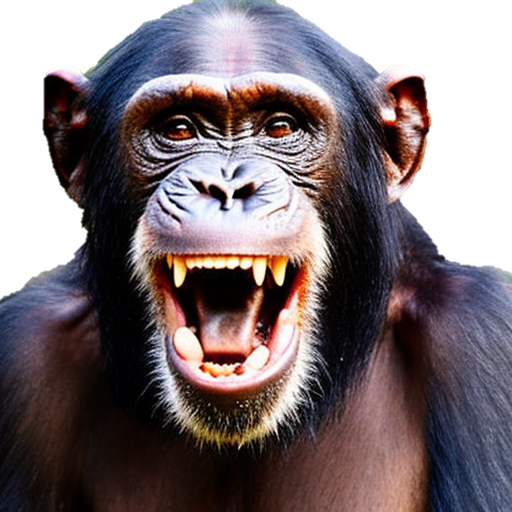

# Single Image 3D Reconstruction Using NeRF

## Introduction
This project implements a method for high-fidelity 3D reconstruction from a single 2D image by using NeRF and diffusion models. The key objective is to improve upon traditional 3D reconstruction methods by incorporating diffusion priors for enhanced texture and geometric details.

[](https://github.com/qqqxs/Simulation-Clock/graphs/contributors)
[](https://github.com/qqqxs/Simulation-Clock/network/members)
[](https://github.com/qqqxs/Simulation-Clock/stargazers)
[](https://github.com/qqqxs/Simulation-Clock/issues)
[](https://github.com/qqqxs/Simulation-Clock/blob/main/LICENSE)

<div class="half">
    
</div>

## Features
- **Two-Stage Optimization Process**: Implements a novel two-stage approach. The first stage focuses on generating an initial 3D geometric structure using NeRF with positional encoding, hierarchical sampling, and volumetric rendering techniques. The second stage refines the model by converting the rough geometry into a textured point cloud, enhancing visual details using high-quality texture mapping and diffusion priors.
  
- **High-Fidelity 3D Reconstruction**: Leveraged NeRF’s ability to simulate complex lighting effects to achieves highly detailed and realistic 3D models from a single 2D image.

- **Diffusion-Based Texture Enhancement**: Enhances model texture and detail quality through the integration of diffusion priors during the refinement stage, achieving a more realistic and visually accurate 3D model.

- **Broad Application Potential**: Applicable to real-world 3D scene modeling, cultural heritage preservation, and high-quality AIGC generation.

## Technologies Used
- **NeRF**: Utilized Mip-NeRF for efficient 3D scene representation and multi-scale neural rendering, improving geometric detail and scene reconstruction quality.
  
- **Diffusion Model**: Employed Stable Diffusion 2.0 to enhance texture quality and generate high-fidelity visual details during the refinement stage.

- **SAM**: Applied SAM to segment foreground masks from input images, ensuring accurate 3D reconstruction by isolating relevant visual elements.

- **BLIP-2**: Used BLIP-2 to generate reliable textual descriptions from input images, aiding in semantic understanding and model optimization.

- **DPT**: Incorporated DPT for depth estimation of foreground images, facilitating accurate geometric modeling in 3D reconstruction.

- **Tiny-CUDA-NN**: Leveraged Tiny-CUDA-NN as the NeRF training framework, enabling faster training and inference by optimizing GPU usage.

- **PyTorch3D**: Utilized PyTorch3D to handle complex 3D data processing, including mesh and point cloud manipulations for efficient model creation.

- **Contextual Loss**: Implemented contextual loss to evaluate and improve the quality of 3D model reconstructions, ensuring visual fidelity and accuracy.

- **Raymarching**: Enabled fast real-time scene rendering through raymarching, providing efficient visualization of complex 3D environments.


## Deployment Environment

The following versions were used for environment setup in this project:

- **Python**: 3.8
- **CUDA**: 11.8.0
- **cuDNN**: 8.9.2
- **PyTorch**: 2.2.0
- **TorchVision**: 0.17.0
- **TorchAudio**: 2.2.0
- **CUB**: 1.17.2


## Installation
1. Clone the repository:
```
   git clone https://github.com/qqqxs/Single-Image-3D-Reconstruction-Based-on-NeRF.git
```
2. Install the required dependencies:
```
   pip install -r requirements.txt
```
3. Download [DPT weights](https://github.com/intel-isl/DPT/releases/download/1_0/dpt_hybrid-midas-501f0c75.pt) and put it under \DPT\weights.
4. Download [CLIP](https://huggingface.co/openai/clip-vit-large-patch14) and put it under \openai.
5. Download [SAM](https://dl.fbaipublicfiles.com/segment_anything/sam_vit_b_01ec64.pth) and put it under \segment-anything-main\models.
6. Download [Stable Diffusion](https://huggingface.co/stabilityai/stable-diffusion-2) and put it under \stabilityai.
7. Download [BLIP-2](https://storage.googleapis.com/sfr-vision-language-research/BLIP/models/model_base.pth) and put it under \salesforce.

## Train

### Coarse Stage

**Initial 2000 Iterations**: Begin the training with a restricted range of camera views to allow the model to leverage reference views effectively, which helps avoid potential overfitting that could arise from random view sampling during early stages.
```
    python main.py --workspace <workspace_name> --ref_path <path_to_image> --phi_range 135 225 --iters 2000
```
**Continue for 3000 More Iterations**: After the initial 2000 iterations, further refine the model by continuing training for 3000 additional iterations. Adjust the field of view (FOV) if the model is showing issues with elongated geometries.
```
    python main.py --workspace <workspace_name> --ref_path <path_to_image> --phi_range 135 225 --albedo_iters 3500 --iters 5000 --final
```
If you encounter elongated geometries, you can increase the FOV parameters:
```
    python main.py --workspace <workspace_name> --ref_path <path_to_image> --phi_range 135 225 --fov 60 --fovy_range 50 70 --blob_radius 0.2 --albedo_iters 3500 --iters 5000 --final
```
### Refine Stage

In the refinement stage, further train the model to improve the texture and geometry detail. If you still encounter issues with geometries, you can continue to adjust the FOV parameters during this stage.

Continue refining the model for an additional 3000 iterations:
```
    python main.py --workspace <workspace_name> --ref_path <path_to_image> --phi_range 135 225 --refine_iters 3000 --refine
```
## Results

The method implemented delivers highly accurate and visually realistic 3D reconstructions, surpassing traditional approaches in both speed and quality. The model produces detailed geometry and texture from a single image, maintaining semantic consistency across novel views. Quantitative evaluations (e.g., SSIM, PSNR, LPIPS, CLIP Score) confirm superior performance, especially in scenarios with intricate textures and complex shapes, making this approach particularly effective for real-world applications such as virtual reality and AI-generated content.
